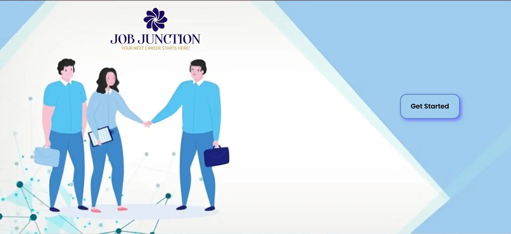
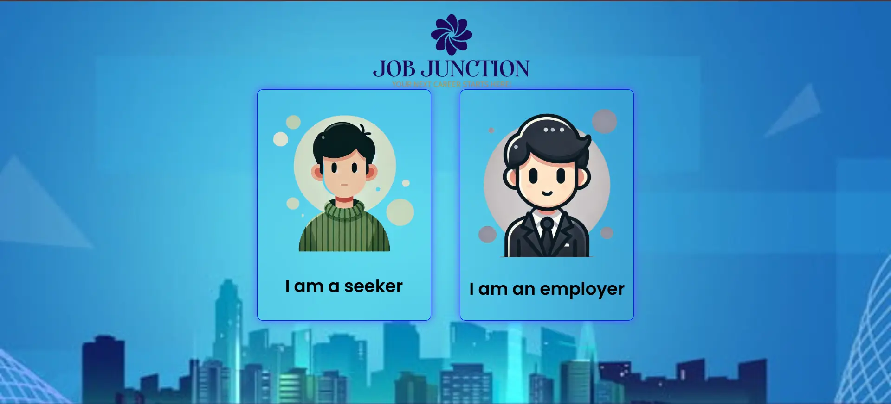
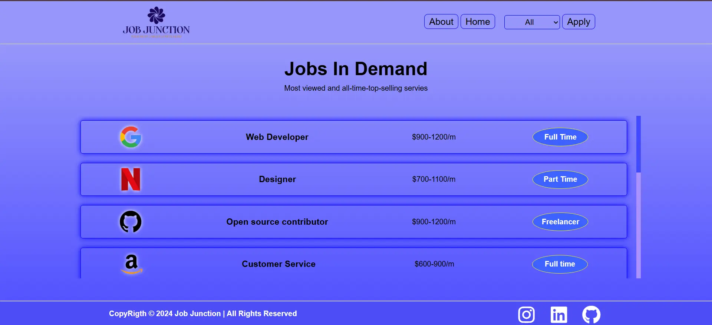
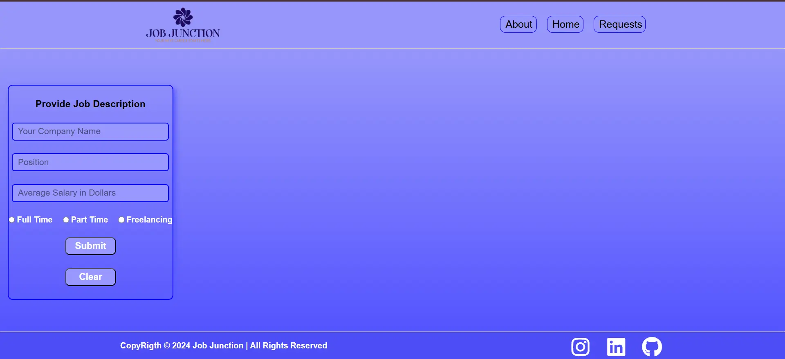

## 🧹 Code Cleanliness & Performance

To keep Job Junction fast and maintainable:
- Periodically audit and remove unused CSS and JavaScript code.
- Use tools like PurgeCSS, UnCSS, or browser DevTools Coverage tab to find dead code.
- Minify assets for production (see minified files in the repo).

# 💼 Job Junction

**Job Junction** is a responsive and modern job portal web application built with HTML, CSS, and JavaScript. It provides a clean interface for users to explore job opportunities. The project is currently under development as part of open-source contributions in the GirlScript Summer of Code (GSSoC).


## ✨ Key Features (Implemented & Planned)

| Category     | Feature                                        | Status         |
|--------------|------------------------------------------------|--------------  |
| Core UI      | "Get Started" button leading to homepage       | ✅ Done       |
| Design       | Responsive UI with background image & logo     | ✅ Done       |
| Styling      | Font Awesome icons, Google Fonts (Poppins)     | ✅ Done       |
| Auth         | Firebase Authentication                        | 🛠️ In Progress|
| Navigation   | Homepage routing                               | ✅ Done       |


## 🛠️ Tech Stack

- HTML5  
- CSS3  
- JavaScript  
- Firebase (for authentication – under progress)  
- Font Awesome  
- Google Fonts (Poppins)

## 🏗️ System Architecture

```
Client (Browser) ─────────────────────────────────────────────┐
│                                                            │
│ 1. UI Layer (HTML + CSS)                                   │
│    • index.html         – Landing page                     │
│    • css/style.css      – Styling and responsive design    │
│    • images/            – Logos, backgrounds               │
│                                                            │
│ 2. Logic Layer (JavaScript)                                │
│    • js/script.js       – Button handling, navigation      │
│                                                            │
│ 3. Authentication Layer (Firebase)                         │
│    • Firebase config (in JS file)                          │
│    • Handles login/signup (in progress)                    │
│                                                            │
└─────────────────────────────────────────────────────────────
```


✔️ **Offline-Ready UI**: Runs fully in browser using static files  
🔐 **Firebase**: Planned for user authentication & real-time features  


## 📸 Screenshots

| Page               | Preview                                                   |
|--------------------|-----------------------------------------------------------|
| Landing Page       |          |
| User Role Selector |           |
| Seeker Dashboard   |       |
| Employer Dashboard |   |


## 🗂️ Folder Structure

```
JOB-PORTAL/
├── assets/
│   ├── (Your asset files, e.g., favicon.png, login-bg.png, logo.png)
├── components/
│   ├── about.css
│   ├── employer.html
│   ├── seeker.js
├── .gitignore
├── index.html
├── LICENSE
├── README.md
├── script.js
└── style.css
```


**🚀 Getting Started**


## 🛠️ How to Use & Contribute

### 1. Clone

```bash
git clone https://github.com/your-username/Job-Portal.git
cd Job-Portal
```

### 2. Run Locally

Any static server works. With **VS Code**:

1. Install the **Live Server** extension  
2. Right-click `index.html` → **“Open with Live Server”**

### 3. Contribute

- Pick an issue labelled **Level 1**, **Level 2**, or **Level 3**
- Create a feature branch:  
  ```bash
  git checkout -b feat/your-feature-name
  ```
- Follow the style guide, submit a **Pull Request**, and respond to reviews


  ## 🧑‍💻 Contribution Workflow

| Step                                                     |
|----------------------------------------------------------|
| Fork the repository                                      |
| Create a new branch: `git checkout -b your-feature-name` |
| Make your changes                                        |
| Commit: `git commit -m "Add: feature description"`       |
| Push: `git push origin your-feature-name`                |
| Open a Pull Request on GitHub                            |


## 🛣️ Roadmap (Upcoming)

| Upcoming Tasks                                  |
|-------------------------------------------------|
| 🔒 Complete Firebase Authentication             |
| 📱 Improve responsiveness for all device sizes  |
| 🌐 Deploy via GitHub Pages                      |
| 🧪 Add more UI components (Search, Filters, Listings) |
| 🗃️ Add dummy job data                           |


## 👥 Community & Support

| Channel            | Purpose                             |
|--------------------|-------------------------------------|
| GitHub Issues      | Bug reports, feature requests       |
| GitHub Discussions | Q&A, ideas, polls                   |
| Discord            | Real-time chat, pair programming    |
| GSSoC Mentors      | Onboarding & code reviews           |


This project is a part of GirlScript Summer of Code (GSSoC).
We're glad to support first-time contributors and open-source learners!

📄 License
This project is open source and available under the MIT License.

⭐ If you like this project, don’t forget to star the repo and contribute!


